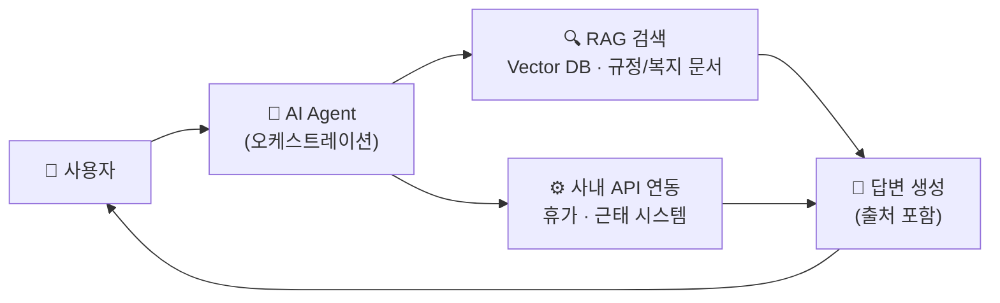

# 🤖 AI Agent + RAG 기반 사내 인력관리 챗봇

> 사내 규정 · 복지 문의를 자동으로 해결하는 대화형 AI 에이전트

[](#프로젝트-상태)
[](#license)

---

## 📌 Overview

사내에는 휴가, 복지, 근태 규정 등에 대한 반복적인 문의가 매일 발생하지만, HR 담당자가 일일이 확인하고 회신하는 과정에서 응답 지연과 리소스 낭비가 생깁니다.

이 프로젝트는 **RAG(Retrieval-Augmented Generation)** 로 사내 규정·복지 문서에서 정확한 근거를 찾고, **AI Agent** 가 대화 맥락을 이해해 후속 질문과 실제 액션(휴가 신청 연동 등)까지 처리하는 사내 챗봇을 만드는 사이드 프로젝트입니다.

## 🧩 문제 정의

| 문제 | 설명 |
|---|---|
| 반복되는 규정 문의 | 휴가·복지·근태 등 유사 질문이 HR팀에 매일 반복 접수 |
| 느린 응답 속도 | 담당자 확인 후 회신까지 대기 시간 발생, 실시간 대응 어려움 |
| HR 리소스 낭비 | 단순 반복 응대에 인력이 소모되어 핵심 업무 집중도 저하 |

## 💡 왜 Agent + RAG인가

| 비교 항목 | FAQ 챗봇 | RAG 챗봇 | **Agent + RAG (본 프로젝트)** |
|---|---|---|---|
| 최신 규정 반영 | 미리 정의된 답변만 가능 | 문서 업데이트만으로 반영 | **문서 업데이트만으로 반영** |
| 대화 맥락 유지 | 단발성 질문·답변 | 제한적 (단일 턴 중심) | **멀티턴 대화 및 추론** |
| 실제 액션 수행 | 불가 | 불가 (정보 제공만) | **사내 시스템 연동 및 처리** |
| 확장성 | 규칙 추가 시마다 재작업 | 문서 추가로 확장 용이 | **문서 + 도구(Tool) 확장 가능** |

## ✨ 핵심 기능

- **출처 기반 답변**: 답변에 근거 문서를 함께 표시해 신뢰도 확보
- **멀티턴 대화**: 이전 대화 맥락을 유지해 자연스러운 후속 질문 처리
- **액션 연동**: 휴가 신청, 근태 조회 등 실제 업무 처리까지 지원
- **권한별 응답 제어**: 직급·부서에 따라 정보 접근 범위를 다르게 관리

## 🏗️ 시스템 아키텍처



Agent가 질문 유형(정보 조회 vs 액션 요청)에 따라 RAG 검색과 사내 API 호출 중 필요한 경로를 판단해 실행합니다.

### Agent 동작 흐름

1. **질문 입력** — 사용자가 자연어로 질문 입력
2. **의도 파악** — 정보 조회 vs 액션 요청 분류
3. **RAG 검색** — Vector DB에서 관련 규정 문서 검색
4. **답변/액션 생성** — 근거 기반 답변 생성 또는 사내 API 호출
5. **응답 전달** — 출처와 함께 답변 제공, 후속 질문 대기

## 🛠️ 기술 스택 (예정)

| 레이어 | 기술 |
|---|---|
| Frontend | React, TypeScript |
| Backend | FastAPI (Python) |
| Agent / Orchestration | Claude API, LangGraph |
| Vector DB | Chroma / Pinecone |
| 문서 파이프라인 | 임베딩 생성 · 청킹 |
| Infra | Docker, AWS |

> 아직 아이디어 구상 단계로, 위 스택은 구현 과정에서 변경될 수 있습니다.

## 🎯 기대효과 / 목표

- **80%** — 반복 규정 문의 자동 해결 목표
- **24/7** — 시간 제약 없는 상시 응대
- **1건** — 문서 업데이트만으로 전체 답변 최신화

## 🗺️ 로드맵

- [ ] **Step 1.** 기획 & 요구사항 정의 — 핵심 시나리오, 문서 범위, 성공 지표 설정
- [ ] **Step 2.** 데이터 구축 & RAG 파이프라인 — 규정/복지 문서 정리, 임베딩·검색 구현
- [ ] **Step 3.** Agent 프로토타입 개발 — 의도 분류, 도구 연동, 내부 테스트
- [ ] **Step 4.** 파일럿 운영 & 고도화 — 실사용 피드백 반영, 정확도·응답속도 개선

## 📂 프로젝트 구조

```
hr-agent-rag/
├── data/
│   └── sample_docs/        # ⚠️ 데모용 샘플 규정 문서 (실제 회사 문서 아님)
├── src/
│   ├── config.py           # 환경 변수 설정
│   ├── main.py              # FastAPI 엔트리포인트
│   ├── agent/
│   │   ├── orchestrator.py # Agent 오케스트레이션 (RAG + Tool 호출)
│   │   └── prompts.py       # 시스템 프롬프트
│   ├── rag/
│   │   ├── ingest.py        # 문서 -> 임베딩 -> Chroma 색인
│   │   └── retriever.py     # 벡터 검색
│   └── tools/
│       └── hr_system.py     # 사내 휴가/근태 API Mock
├── tests/
│   └── test_tools.py
├── requirements.txt
├── .env.example
└── LICENSE
```

## 🚀 실행 방법 (Getting Started)

```bash
# 1. 의존성 설치
pip install -r requirements.txt

# 2. 환경 변수 설정
cp .env.example .env
# .env 파일을 열어 ANTHROPIC_API_KEY 값을 채워주세요.

# 3. RAG 인덱스 생성 (샘플 문서 기준)
python -m src.rag.ingest

# 4. 서버 실행
uvicorn src.main:app --reload
```

서버 실행 후 아래처럼 호출해볼 수 있습니다.

```bash
curl -X POST http://localhost:8000/chat \
  -H "Content-Type: application/json" \
  -d '{"session_id": "test-1", "message": "연차는 1년에 며칠 발생해?"}'
```

> ⚠️ `data/sample_docs`는 데모용 가짜 규정 문서입니다. 실제로 사용하려면
> `.env`의 `DOCS_DIR`을 실제(비공개) 사내 문서 폴더로 변경하고, 해당 폴더는
> `.gitignore`에 추가해 저장소에 올라가지 않도록 하세요.

## 🧪 테스트

```bash
pytest
```

## 📁 프로젝트 상태

현재 **초기 프로토타입 단계**입니다. Agent 오케스트레이션과 RAG 파이프라인의
기본 골격은 구현되어 있으며, 실제 사내 시스템 연동(`src/tools/hr_system.py`)은
Mock으로 대체되어 있습니다.

## 📄 License

이 프로젝트는 [MIT License](LICENSE)를 따릅니다.

## 📬 Contact

궁금한 점이나 제안이 있다면 Issue를 남겨주세요.
